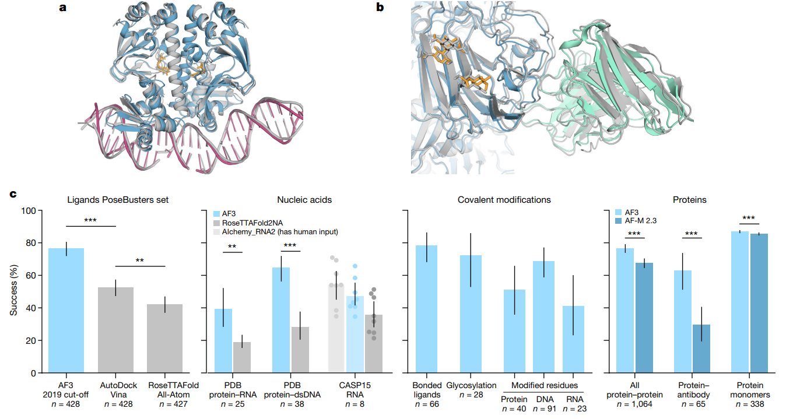
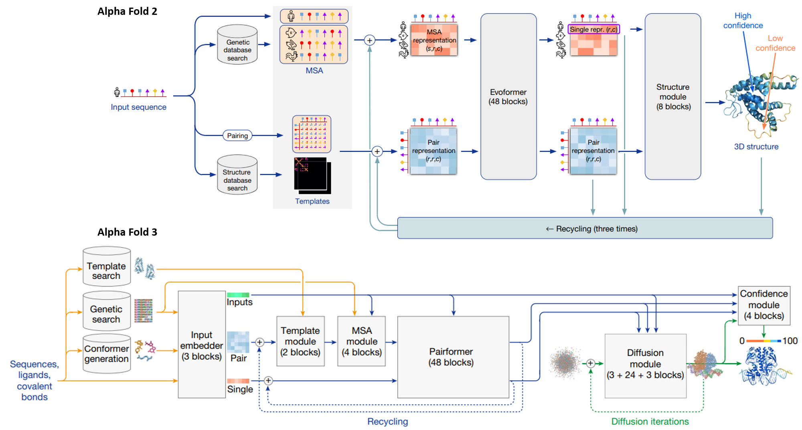
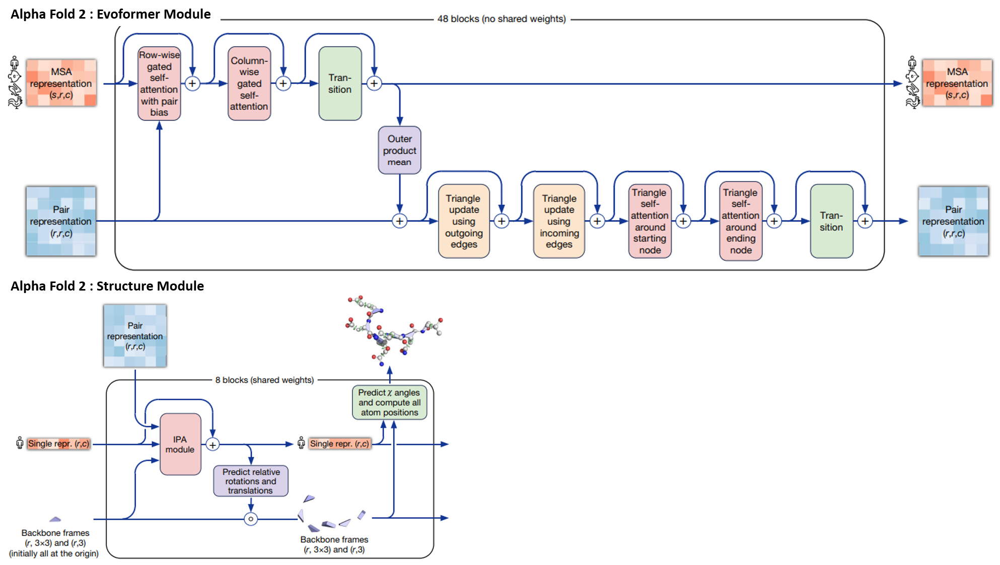
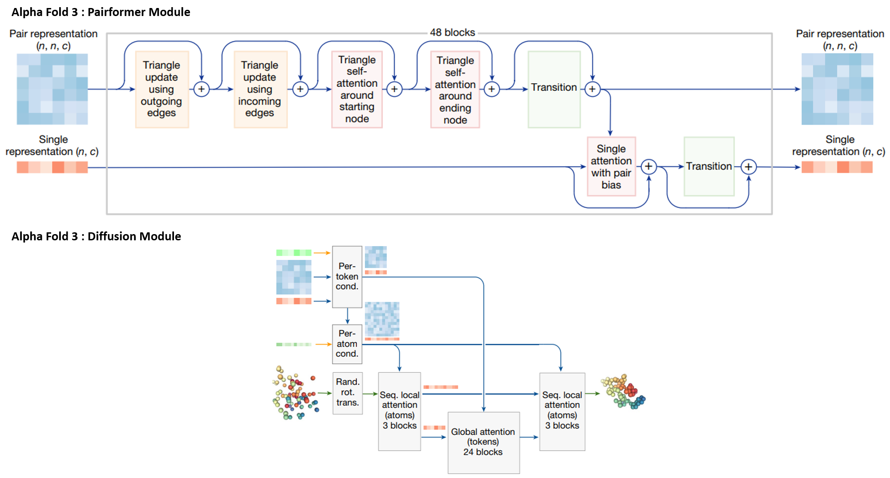
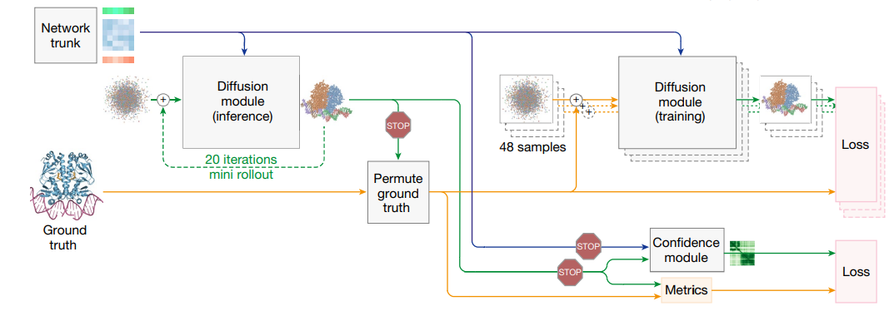

**AlphaFold 3 represents a transformative leap in the field of biomolecular structure prediction**, introducing a single, unified framework that can accurately model a wide spectrum of biologically relevant molecules. Unlike its predecessors, which were typically constrained to proteins or required specialized adaptations for different molecular types, AlphaFold 3 seamlessly predicts the structures of *proteins, nucleic acids (DNA/RNA), small-molecule ligands, metal ions, and covalent modifications* within a single architecture.

At the core of this breakthrough lies a **diffusion-based generative approach**, which enables the model to reason over complex, multi-component assemblies in an end-to-end fashion. This paradigm shift allows AlphaFold 3 not only to match but often surpass traditional domain-specific methods — from protein-ligand docking tools to nucleic acid structure predictors — in both accuracy and generality.

This post delves into the architecture and capabilities of AlphaFold 3, highlighting how it overcomes long-standing limitations in the field, such as rigid separation between molecule types and poor generalization to unseen chemistries. We also explore its performance across a diverse set of benchmarks, showing that this unified model is not just a convergence of tasks — it's a *redefinition of what's possible in computational structural biology*.

Introduction: Beyond Proteins, Toward All Biomolecules
------------------------------------------------------

While AlphaFold 2 revolutionized protein structure prediction, it still had limitations when addressing diverse biomolecular complexes involving protein-ligand interactions, protein-RNA complexes, sugars, and modified residues. These complex systems typically required specialized prediction tools. **AlphaFold 3 (AF3)** transcends these limitations, offering a unified framework capable of high-precision prediction for a comprehensive range of complexes including proteins, nucleic acids, ligands, ions, and covalent modifications.

### Understanding the Limits of a Protein-Only Perspective(AlphaFold 2)

While **AlphaFold2** revolutionized protein structure prediction by achieving near-experimental accuracy for monomeric proteins, it still falls short in modeling the full complexity of biomolecular interactions that govern life.

First, AlphaFold2 is inherently **limited to individual proteins**, leaving out the wide range of interactions proteins engage in—such as with other proteins, DNA, RNA, small-molecule ligands, metal ions, and post-translational modifications. For these, researchers must rely on a fragmented toolbox of specialized methods, each with their own assumptions, formats, and limitations.

Second, although extensions like **AlphaFold-Multimer** attempted to address protein-protein complexes, they often underperformed on diverse assemblies such as antibody-antigen complexes or flexible multi-chain systems. This made accurate modeling of protein complexes an inconsistent and unreliable task.

Third, AlphaFold2 offers a **deterministic prediction pipeline**, unable to capture the conformational diversity or molecular flexibility that is often crucial in drug binding or allosteric regulation.

Finally, AlphaFold2 cannot reason over **heterogeneous biomolecular assemblies**. Real biological systems often involve interactions across molecular modalities — a protein binding to both a ligand and an RNA strand in a coordinated manner. Such cases are outside the design scope of AlphaFold2, forcing researchers to stitch together predictions from different models in an ad hoc, error-prone fashion.

In short, AlphaFold2 laid a powerful foundation, but to fully understand and simulate the intricacies of biological structure and function, we need a **unified, multimodal model** that can reason over complex assemblies holistically. This is exactly the ambition of AlphaFold3.

### Introducing AlphaFold 3: One Model to Predict Them All

To address these limitations, **AlphaFold 3** enters the scene as a transformative leap forward — a single model that predicts the structures of not just proteins, but also *nucleic acids, small molecules, ions, covalent modifications, and entire complexes*. It does so through a new architecture that integrates sequence, structure, and chemical context into a unified reasoning framework.

At the heart of AlphaFold 3 lies a **diffusion-based generative model**, allowing it to sample and refine multi-component molecular assemblies in an end-to-end fashion. This makes AlphaFold 3 not only more general than its predecessors, but often more accurate — even compared to traditional, domain-specific tools in molecular docking, RNA folding, and complex prediction.

In the following sections, we will dive into how AlphaFold 3 works, what differentiates it architecturally, and how it performs across a wide spectrum of biomolecular benchmarks.

AlphaFold 3 Architecture: A Unified Redesign
--------------------------------------------

AlphaFold 3 (AF3) marks a radical departure from the architecture of AlphaFold 2 (AF2), introducing a comprehensive framework capable of modeling a diverse array of biomolecules. Unlike its predecessor, which focused exclusively on proteins, AF3 can handle proteins, nucleic acids, small-molecule ligands, metal ions, and covalent modifications within a single unified system. This transformation is built upon four core modules:

1. **Input Embedding**
2. **Trunk (Pairformer)**
3. **Structure Prediction (Diffusion Module)**
4. **Confidence Assessment**

Let's examine the key innovations in each component.

### Input Module: Multimodal Foundations

The input module ingests diverse biological entities using three sub-blocks:

* **Protein and Nucleic Acid Sequences:** Handled via standard or learned embeddings.
* **Small Molecules:** Represented using SMILES and processed as 2D molecular graphs.
* **Covalent Linkage Information:** Predefined bonding patterns (e.g., peptide bonds, covalent ligands) are included.

This modularity allows for a seamless transformation into a shared representation space across modalities, ensuring downstream modules can process inter-molecular interactions effectively.

### 2. Trunk Module: From Evoformer to Pairformer

AF3 replaces AF2's Evoformer with a more streamlined and generalizable structure: the Pairformer. Key changes include:

* **Reduced reliance on MSA:** Instead of extensive MSA stacks, only 4 simplified blocks initialize pairwise embeddings via weighted averaging.
* **48 Pairformer Blocks:** These update residue-residue interactions with components such as PairAttention and Triangle Updates:

\text{PairRepresentation}\_{i,j}^{(l+1)} = \text{PairAttention}(\text{Pair}\_{i,j}^{(l)}) + \text{TriangleUpdate}\_{i,j} + \ldots

This trunk encodes complex residue-pair relationships before forwarding the latent representation to the structure module.

This design focuses on updating information based on residue-pair interactions, with the resulting representation feeding directly into the structure prediction module.

### 3. Structure Prediction: Diffusion-Based Generative Modeling

The structure module replaces the torsion-based method from AF2 with a diffusion generative model. During training, atom coordinates are noised and denoised in a fashion inspired by DDPMs:

\epsilon\_\theta(z\_t, t) \approx \frac{z\_t - z\_0}{\sigma\_t}

This allows the model to learn both local and global atomic configurations, enabling precise prediction of diverse biomolecular assemblies, including side chains and bound ligands.

* During training, the model learns to predict the original structure z0 from atom coordinates zt with added noise
* The noise magnitude σt allows the model to simultaneously learn local and global structural information
* This approach enables direct prediction of diverse biomolecular structures while maintaining side-chain precision

### 4. Confidence Head: Interpretable Structure Reliability

AF3 incorporates robust confidence metrics alongside structure prediction:

* **pLDDT:** Per-residue confidence scores.
* **PAE:** Predicted Aligned Error between residue pairs.
* **PDE:** Predicted Distance Error across atoms.

These outputs provide fine-grained interpretability, supporting the use of AF3 structures in downstream experimental and design pipelines.

Training Methodology
--------------------

### 📊 Three-Stage Training Pipeline

* **Initial training:** Crop size = 384 tokens, 256 mini-batches × 48 diffusion samples per step (total: 12,288)
* **Fine-tuning 1:** Crop size increased to 640
* **Fine-tuning 2:** Final stage with crop size = 768

The model incorporates a **diffusion rollout** technique for confidence head training, which involves predicting full structures and learning confidence metrics based on the differences between predictions and ground truth.

### 🔁 Diffusion-Based Generative Learning

The model is trained to predict the original atom positions `z₀` from noisy inputs `zₜ`, where the noise level `σₜ` controls the structural scale being learned. Low noise focuses on local stereochemistry; high noise focuses on global conformation.

This denoising task helps AlphaFold 3 learn structural hierarchies end-to-end, eliminating the need for torsion-based residue parametrizations and specialized loss terms.

### 🧠 Preventing Hallucination with Cross-Distillation

Generative models tend to hallucinate structure in disordered regions. To counteract this, AlphaFold 3 uses **cross-distillation** from AlphaFold-Multimer predictions, training the model to mimic loop-like unstructured regions instead of compact hallucinations.

### 📈 Confidence Modeling via Mini-Rollouts

Because only a single diffusion step is trained at a time, AlphaFold 3 uses a "mini-rollout" to generate intermediate predictions during training. These are used to compute confidence scores such as:

* `pLDDT` – Predicted local structural accuracy
* `PAE` – Predicted aligned error matrix
* `PDE` – Predicted distance error matrix

### ⚖️ Adaptive Sampling & Early Stopping

Not all interaction types are equally abundant. AlphaFold 3 adjusts training by increasing the sampling probability of undertrained tasks and reduces it for overfitted ones. Final model selection is based on a weighted combination of structural and interface metrics.

Performance: A Universal Model Outperforming Specialized Approaches
-------------------------------------------------------------------

AlphaFold 3 delivers state-of-the-art performance across a wide variety of biomolecular structure prediction tasks, setting new benchmarks in protein-ligand docking, protein-nucleic acid complexes, antibody-antigen interfaces, and covalent modifications.

### Protein–Ligand Complexes

Using the PoseBusters benchmark, AF3 significantly outperforms classical docking methods like Vina (p = 2.3×10⁻⁸), achieving sub-2Å RMSD for most ligands while preserving valid stereochemistry and avoiding clashes.

* **Success criterion**: ligand RMSD < 2Å
* **AF3 performance**: Significantly outperforms Vina and other specialized docking tools
* **Statistical significance**: Fisher's test, p=2.27×10−13

### Protein-Protein & Antibody-Antigen Interfaces

Compared to AlphaFold-Multimer v2.3, AF3 shows significant improvements in DockQ scores across general protein-protein and antibody-antigen interactions. Monomeric LDDT scores also see large gains (p = 1.7×10⁻³⁴).

* **Success criterion**: DockQ > 0.23
* **Improvement**: Substantial enhancement over AlphaFold-Multimer 2.3 (Wilcoxon test, p=1.8×10−18)

### RNA and DNA Complex Prediction

AF3 surpasses RoseTTAFold2NA and AIchemy\_RNA in CASP15 RNA targets and handles pure nucleic acid structures and large hybrid complexes with consistent accuracy, even in low-homology settings.

### Covalent Modifications

AF3 accurately predicts structures with covalent modifications (e.g., bonded ligands and glycans). For example, it achieves a 46.1% success rate (RMSD < 2Å) for high-quality single-residue glycan predictions.

### Reliable Confidence Estimates

AF3 outputs pLDDT, PAE, and PDE metrics that are well-calibrated and predictive of true model accuracy. These allow users to judge prediction reliability in both local and global contexts.

| Task | Benchmark | AF3 Performance | Baseline |
| --- | --- | --- | --- |
| Protein-Ligand | PoseBusters | 80.2% success (RMSD < 2Å) | Vina: 42.1%, UniMol: 56.3% |
| Protein-RNA/DNA | PDB, CASP15 | Higher LDDT | RoseTTAFold2NA |
| Protein-Protein | DockQ > 0.23 | 84.1% | AF-Multimer2.3: 72.6% |
| Modified Ligands | RMSD < 2Å | 65.4% success | - |

Table 1: Comparison of AlphaFold 3 performance against specialized tools across different biomolecular prediction tasks.

Model Implications and Limitations
----------------------------------

### Strengths

* **Universal biomolecular structure prediction:** AF3 unifies protein, nucleic acid, ligand, ion, and modification modeling into a single architecture, enabling holistic simulation of complex biological systems.
* **Diffusion-based generation for flexible structure modeling:** Its generative formulation allows sampling of diverse conformations, capturing both rigid and flexible binding events, critical for real-world interactions.
* **Torsion-free stereochemistry precision:** By directly predicting atomic coordinates, AF3 achieves accurate stereochemical detail without relying on torsion angle parametrization, enhancing generalizability across molecular types.

### Limitations

* **Chirality errors (~4.4%):** In some cases, the model predicts mirror-image structures, which can significantly affect biological activity and binding specificity.
* **Atomic overlaps:** Predicted structures may include steric clashes, particularly in complex interfaces, requiring post-processing or refinement.
* **No conformational dynamics:** AF3 predicts static ground-state structures and does not capture dynamic transitions essential in many biological functions.
* **Sampling dependency:** For ambiguous or large complexes, multiple random seeds are often required to obtain high-quality results, increasing inference cost.

Conclusion
----------

AlphaFold 3 represents a unified deep learning framework capable of accurately predicting structures across protein-ligand, protein-RNA/DNA, antibody-antigen, and modified biomolecular complexes. This marks a decisive shift in structure-based biology from combinations of specialized tools toward a single integrated model.

By adopting a generative diffusion approach, AF3 can handle the full spectrum of biomolecular structures while maintaining atomic-level precision. This capability opens new avenues for drug discovery, understanding biological mechanisms, and designing novel biomolecules.

The remarkable performance of AF3 across diverse biomolecular prediction tasks suggests we're entering a new era where AI can reliably predict the structures of virtually any biological macromolecule or complex, potentially transforming our ability to understand and engineer biological systems at the atomic level.

### Author Contributions

This blog post summarizes the AlphaFold 3 technology based on recent publications and available information from DeepMind. The author has no affiliation with DeepMind or the AlphaFold development team.

### Reviewers

Wonbin Lee

KAIST

"이 논문은 AlphaFold 3의 주요 발전 사항을 명확하게 요약하고 있으며, 생체분자 구조 예측 분야에 중요한 기여를 합니다."
